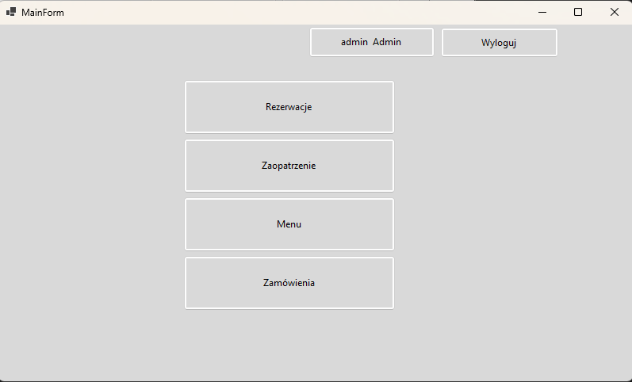
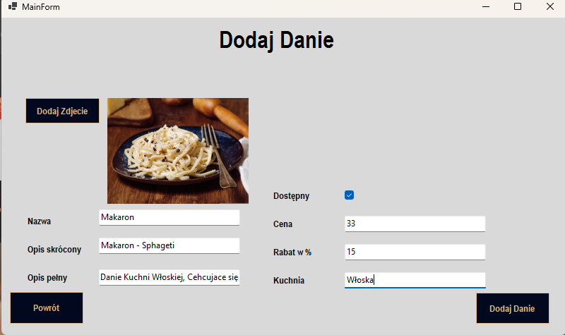
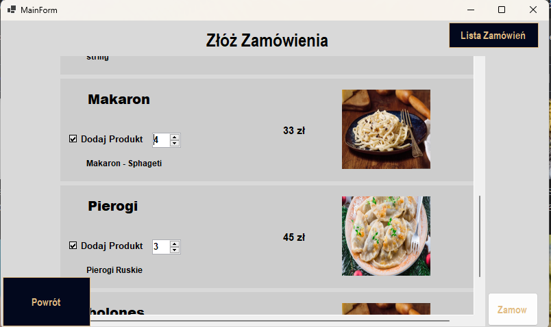

  

    
    

      <strong>Logi View</strong>: This view shows the logging interface, where you can monitor and analyze logs.
    

  

  

    
    

      <strong>Main Menu View</strong>: The main menu provides access to various sections of the application.
    

  

  
  

    
    

      <strong>Add Dish</strong>: Here you can add new dishes to the restaurant's menu.
    

  

  
  

    
    

      <strong>Orders View</strong>: This view shows the list of customer orders and their statuses.
    

  

  

    
    

      <strong>Restaurant Order List</strong>: Here you can see the detailed list of orders for the restaurant.
    

  

