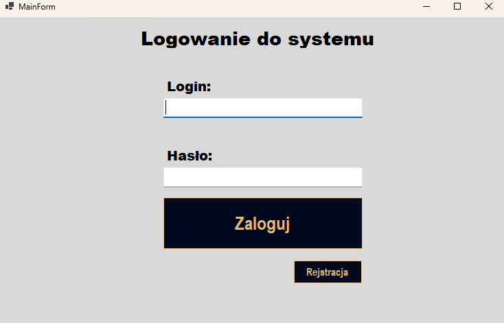
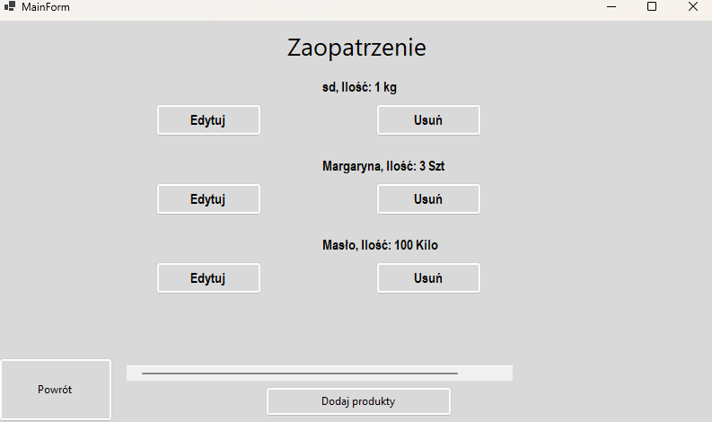
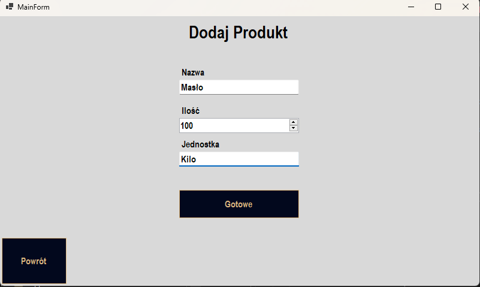
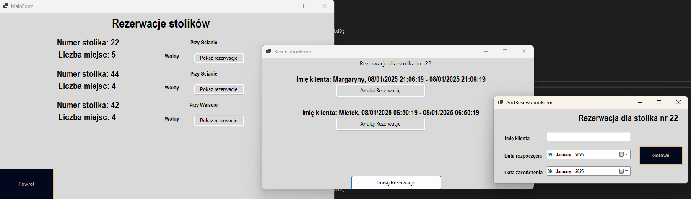

  

    <strong>Application Functionality Example</strong>
  

  

    Created with <a href="https://github.com/Dawideg">@Dawideg</a>
    
  

  

    
    

      <strong>Login View</strong>: This view shows the logging interface, where you can monitor and analyze logs.
    

  

  

    
    

      <strong>Main Menu View</strong>: The main menu provides access to various sections of the application.
    

  

  
  

    
    

      <strong>Add Dish</strong>: Here you can add new dishes to the restaurant's menu.
    

  

  
  

    
    

      <strong>Orders View</strong>: Here you can view the detailed list of orders for the restaurant. This view displays the list of customer orders along with their current statuses.
    

  

  

    
    

      <strong>Restaurant Order List</strong>: Here you can view the detailed list of orders for the restaurant. This view displays the list of customer orders along with their current statuses.
    

  

  

    
    

      <strong>Supplies View</strong>: This view displays the supplies available in the inventory.
    

  

  
  

    
    

      <strong>Add Supplies</strong>: Here you can add new supplies to the inventory.
    

  

  
  

    
    

      <strong>Reservation</strong>: This view allows you to manage table reservations.
    

  

